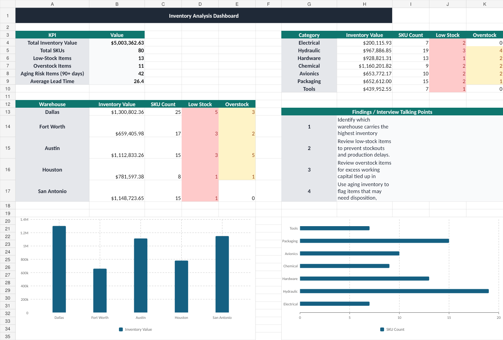

# Inventory Analysis Workbook



## Executive Summary

This project is an Excel-based inventory analysis workbook built for a Business Systems Analyst portfolio.

The purpose of the workbook is simple: take inventory data, clean it up, analyze it, and turn it into a dashboard that leadership can use to make better decisions.

This is not meant to be a basic Excel exercise. I built this project to show practical analyst work around inventory value, reorder risk, overstock risk, aging inventory, warehouse summaries, and business findings.

The sample data in this workbook is fictional and was created for portfolio purposes. No company, customer, vendor, employee, or private business data is included.

---

## Business Problem

Inventory leaders need visibility into what is sitting in stock, where it is located, what it is worth, and what needs attention.

Without a clean inventory view, the business can run into problems like:

- Stockouts that delay production or operations
- Overstock that ties up working capital
- Aging inventory that may need review or disposition
- Poor visibility across warehouses
- Slow decision-making because data is spread across different reports

This workbook helps answer the questions leadership would care about first:

- What is the total inventory value?
- How many SKUs are being managed?
- Which warehouses carry the most inventory value?
- Which items are below reorder point?
- Which items are overstocked?
- Which categories carry the most exposure?
- Which items may require management review?

---

## Project Goal

The goal of this project was to build a practical Excel workbook that could support inventory planning, purchasing decisions, warehouse review, or ERP reporting.

The workbook was designed to show that I can:

- Work with structured business data
- Clean and organize inventory records
- Build useful calculations
- Identify inventory risks
- Summarize results by warehouse and category
- Create a dashboard for leadership
- Document findings in a way that supports business decisions

---

## Tools Used

- Microsoft Excel
- Excel tables
- Formulas
- SUMIFS
- COUNTIFS
- Conditional formatting
- Dashboard design
- Charts
- Data dictionary documentation

---

## Skills Demonstrated

This project demonstrates Excel and analyst skills that apply directly to Business Analyst, Business Systems Analyst, ERP Analyst, Supply Chain Analyst, Procurement Analyst, and Operations Analyst roles.

Key skills shown:

- Inventory data cleanup
- Structured workbook design
- Inventory value calculation
- Reorder risk identification
- Overstock risk identification
- Aging inventory review
- Warehouse-level reporting
- Category-level reporting
- KPI dashboard development
- Business findings documentation
- Data dictionary creation
- Executive-style communication

---

## Workbook Structure

| Tab | Purpose |
|---|---|
| `README` | Workbook overview and instructions |
| `Raw_Data` | Original sample inventory dataset |
| `Clean_Data` | Cleaned and structured inventory data used for analysis |
| `Dashboard` | Executive dashboard with KPIs, summaries, charts, and findings |
| `Data_Dictionary` | Field definitions and workbook documentation |
| `Lists` | Supporting values used for workbook structure |

---

## Files Included

| File | Description |
|---|---|
| `inventory_analysis_workbook.xlsx` | Main Excel workbook |
| `inventory_analysis_dashboard_preview.png` | Dashboard preview image |
| `README.md` | Project documentation |

---

## Dashboard Metrics

The dashboard includes the following metrics:

| Metric | Business Purpose |
|---|---|
| Total Inventory Value | Shows total dollar value of inventory on hand |
| Total SKUs | Shows total number of inventory items being tracked |
| Low-Stock Items | Identifies items that may need reorder review |
| Overstock Items | Identifies items carrying excess inventory |
| Aging Risk Items | Flags items that may need management review |
| Average Lead Time | Shows average supplier or replenishment lead time |
| Inventory by Warehouse | Shows where inventory value is concentrated |
| Inventory by Category | Shows which categories carry the most exposure |
| Low Stock by Warehouse | Helps identify warehouse-level replenishment risk |
| Overstock by Warehouse | Helps identify excess stock by location |

---

## Business Logic

The workbook uses straightforward business logic to flag inventory risks.

### Inventory Value

```text
Inventory Value = Quantity On Hand × Unit Cost
```

This shows how much money is tied up in each inventory item.

### Reorder Risk

```text
If Quantity On Hand <= Reorder Point, then Reorder Needed
```

This flags items that may need purchasing or planning review.

### Overstock Risk

```text
If Quantity On Hand > Max Stock Level, then Overstock
```

This flags items that may be tying up working capital.

### Aging Inventory Risk

```text
If inventory age exceeds the review threshold, then Aging Risk
```

This flags items that may need disposition, demand review, or management attention.

---

## Key Findings Shown in the Dashboard

The dashboard is designed to help leadership quickly identify:

1. Which warehouse carries the highest inventory value
2. Which inventory categories have the most exposure
3. Which items may need to be reordered
4. Which items may be overstocked
5. Which inventory may be aging
6. Where purchasing or planning should focus first
7. What data should be reviewed before making inventory decisions

---

## Business Value

This workbook gives leadership a quick way to review inventory health.

In a real business environment, this type of analysis could help:

- Reduce stockout risk
- Improve purchasing decisions
- Identify excess inventory
- Reduce working capital tied up in inventory
- Improve warehouse visibility
- Support ERP reporting
- Support planning and replenishment decisions
- Give leadership a cleaner view of operational risk

The value is not just the dashboard. The value is the ability to turn raw inventory data into something the business can act on.

---

## How This Connects to Business Systems Analysis

This project connects directly to Business Systems Analyst work.

A Business Systems Analyst often needs to understand the business process, the system data, the reporting need, and the decision being made.

This workbook shows that process:

```text
Raw Data → Clean Data → Business Logic → Dashboard → Findings → Decision Support
```

In a real ERP environment, this type of data could come from systems such as:

- SAP
- Microsoft Dynamics 365
- Oracle
- NetSuite
- Warehouse management systems
- Procurement systems

A Business Systems Analyst may use this type of workbook to support requirements gathering, reporting validation, process improvement, UAT, or stakeholder discussions.

---

## Analyst Talking Points

This project gives me a real portfolio item I can discuss in an interview.

Talking points:

- I built an Excel workbook to analyze inventory value, low-stock risk, overstock risk, and aging inventory.
- I structured the workbook with raw data, cleaned data, a dashboard, a data dictionary, and supporting lists.
- I used formulas and summary logic to turn item-level inventory data into leadership-level KPIs.
- I created warehouse and category summaries to help identify where inventory risk is concentrated.
- I documented the project so another analyst, stakeholder, or reviewer could understand the workbook.
- This type of analysis could support ERP reporting, inventory planning, procurement decisions, or Power BI dashboard development.

---

## What I Would Improve Next

Future improvements could include:

- Add Power Query for repeatable data cleanup
- Add PivotTables and slicers for interactive filtering
- Add purchase order history
- Add supplier performance data
- Add inventory movement history
- Add aging buckets
- Add reorder recommendation logic
- Add SQL-based source data
- Build a matching Power BI dashboard
- Add a formal findings and recommendations tab
- Expand the project into a full supply chain reporting package

---

## Portfolio Context

This project is part of my Business Systems Analyst portfolio.

The portfolio is focused on practical proof across:

- Excel
- SQL
- Power BI
- Business analysis
- ERP processes
- Supply chain systems
- IAM
- GRC and audit controls

The goal is to show real analyst-style work, not just list training or certifications.

---

## Why I Built This

I built this project because I wanted the first proof in my portfolio to connect directly to my background in supply chain, inventory, procurement, and operations.

Excel is still one of the most common tools used in business analysis, supply chain, ERP support, and reporting. This project shows that I can use Excel to organize data, identify risk, summarize findings, and support leadership decisions.

This is the first project in the portfolio, and it will be expanded with SQL, Power BI, ERP process work, IAM access reviews, and GRC control examples.
